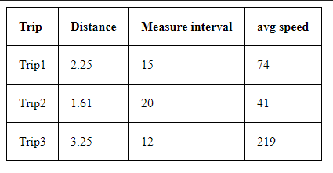

Trips Application
========================

Requirements
------------

  * PHP 7;
  * MySQL PHP extension enabled;
  * and the [usual Symfony application requirements][1].

  Installation
------------

Clone the repository from Git:
```bash
$ git clone https://github.com/kgalanty/ProjectTrips.git
```
Install dependencies:
```bash
$ composer install
```
Configure database connection in .env:
```bash
$ nano .env
```

Create database:
```bash
$ bin/console doctrine:database:create
```

Run migration:
```bash
$ bin/console doctrine:migrations:migrate
```

Populate database with data:
```bash
$ bin/console doctrine:fixtures:load
```

Run [local web server][2]:
```bash
$ symfony server:start
```

Open browser on given URL to see calculation of trips



  [1]: https://symfony.com/doc/current/reference/requirements.html
  [2]: https://symfony.com/download